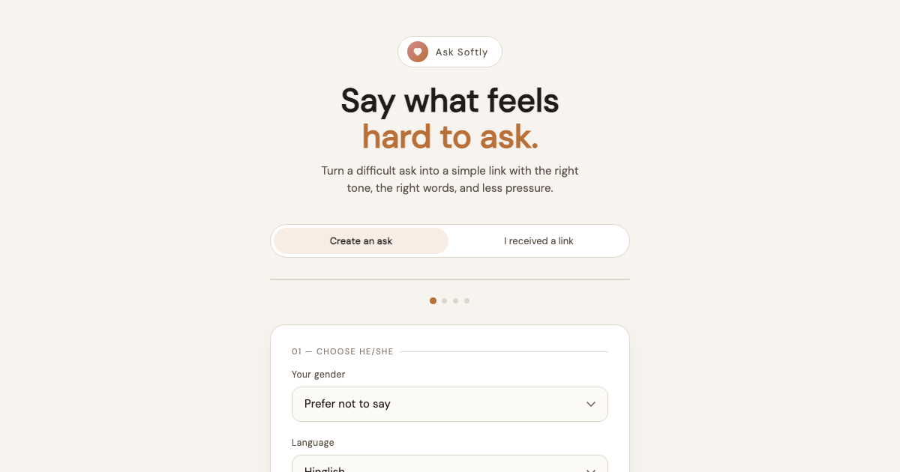
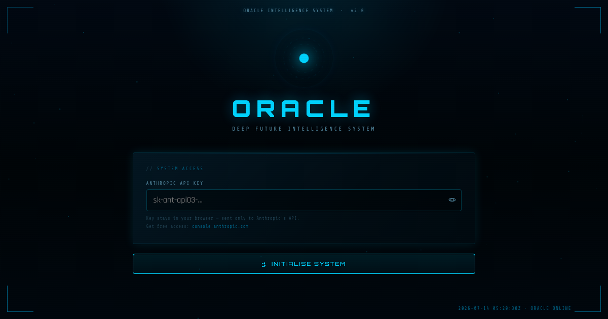
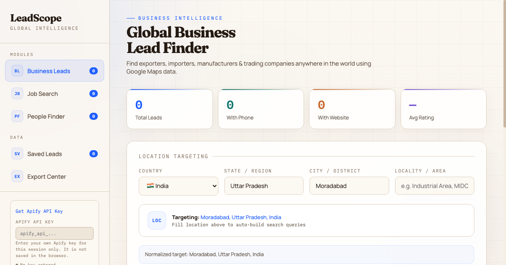
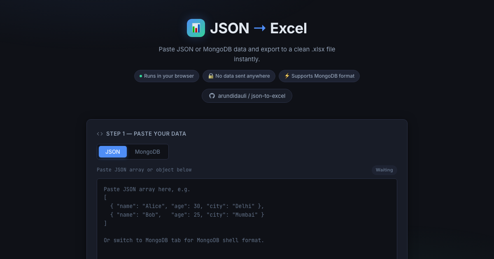
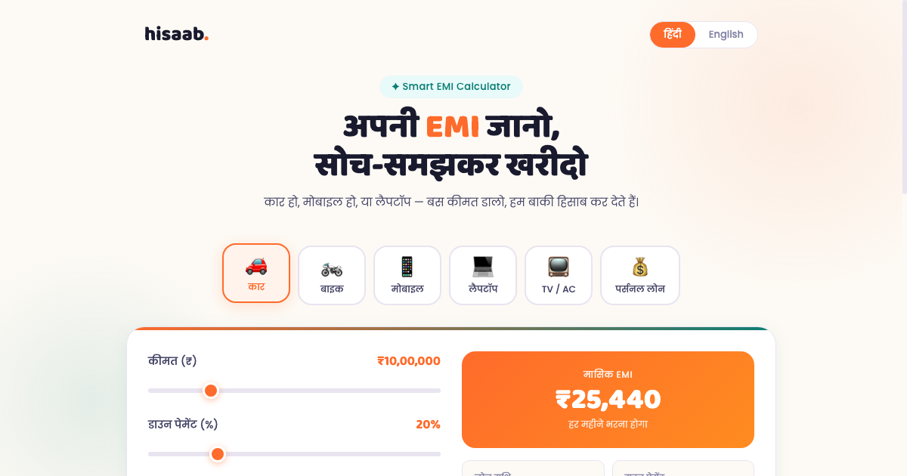
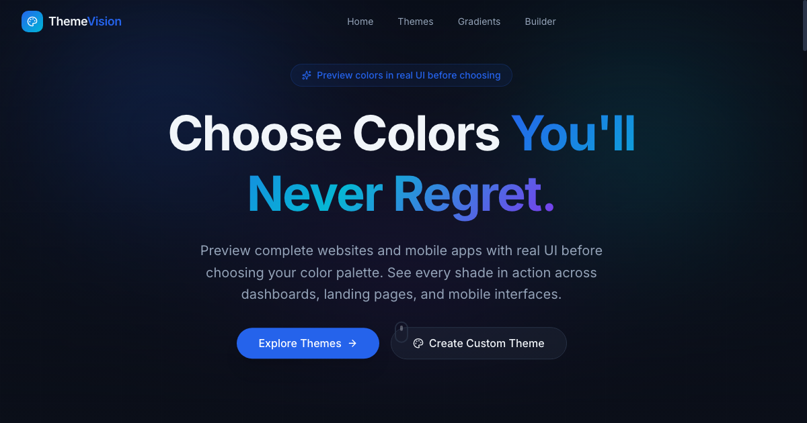
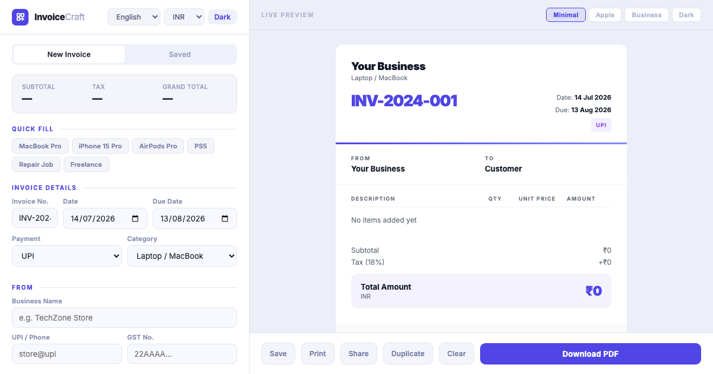
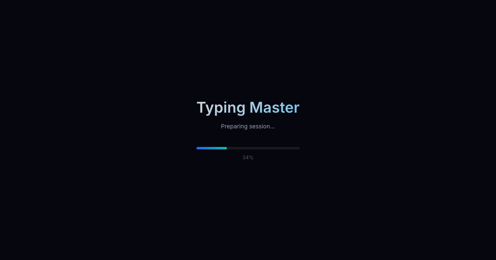
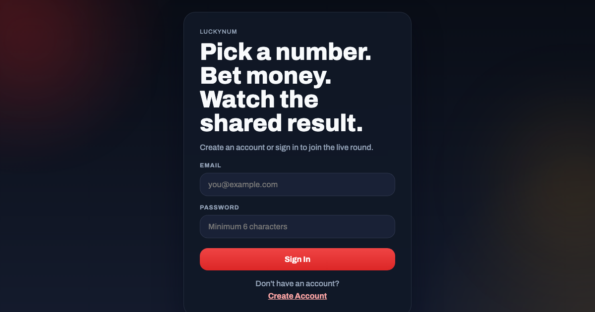

<h1 align="center">👋 Hi, I'm Arun Kumar</h1>
<h3 align="center">Full-Stack Mobile Engineer & Product Builder</h3>

  <b>Flutter • React Native • Android • iOS • Django / Python • Next.js • AI-Dev</b>

  🚀 25+ apps live &nbsp;•&nbsp; 45K+ global users &nbsp;•&nbsp; 5+ years experience &nbsp;•&nbsp; Delhi, India (Open to Remote)

  <a href="mailto:arun080697@gmail.com">📧 arun080697@gmail.com</a> &nbsp;•&nbsp;
  <a href="tel:+919389550053">📞 +91 9389550053</a> &nbsp;•&nbsp;
  <a href="https://linkedin.com/in/arun-kumar-172b57220">LinkedIn</a> &nbsp;•&nbsp;
  <a href="https://arundidauli.github.io">Portfolio</a>

  
  

---

## 🧑‍💻 Professional Summary

Full-Stack Mobile Engineer and product builder with **5+ years** delivering production apps across Flutter, Android, iOS, React Native, and Django/Python backends. Independently designed, built, and shipped live products serving real users. Worked with global clients across **Australia, New Zealand, USA, and Dubai**.

Holds two **Anthropic certifications** — *Claude Code in Action* and *Introduction to Agent Skills*. Early AI-dev practitioner using Claude Code CLI, Cursor, Copilot, and Codex to deliver features **10x faster** and meaningfully reduce LLM API costs in production. Thrives in async-first, remote-distributed team environments.

---

## 🏆 Certifications

| Certification | Issuer | Year |
|---|---|---|
| [Claude Code in Action](https://lnkd.in/gDBbTNMb) | Anthropic | 2026 |
| [Introduction to Agent Skills](https://lnkd.in/gcemyf9C) | Anthropic | 2026 |

---

## 🛠️ AI-Powered Development Toolkit — 10x Delivery

> Shipping production-grade features faster, cutting review cycles, and optimising LLM API costs up to **60%** in live apps.

| Tool | Use | Impact |
|---|---|---|
| **Claude Code CLI** | Agentic coding, refactoring & boilerplate at terminal speed | 10x faster delivery |
| **Cursor IDE** | AI-first editor — codebase-aware completions across large Flutter projects | Multi-file context |
| **GitHub Copilot** | Real-time inline completions across mobile, backend, and web | All stacks |
| **OpenAI API** | Prompt engineering, token optimisation, RAG, function calling, AI agents | ~60% cost savings |

---

## 🚀 Own Live Product — Built, Deployed & Maintained Independently

### [Bicholiyas](https://bicholiyas.in) — Connecting Families for Marriage
`Next.js` `Django REST Framework` `Python` `PostgreSQL` `Flutter`

Independently designed, built, and deployed the complete product — web app, mobile app, and REST API backend. Sole developer across the entire stack. Discover trusted mediators and explore verified profiles across different locations.

---

## 💼 Professional Experience

### Senior Software Engineer & Team Lead — *Infinity Soft Systems, Noida*
`06/2023 – Present` | Remote-capable

- Delivered **10+ production apps** for clients in Australia & New Zealand using Flutter, React Native, iOS Native, Android Native
- Built and maintained Django REST Framework APIs — auth, CRUD, WebSocket endpoints, and third-party integrations
- Integrated AI features via OpenAI API — smart search, in-app assistants, and recommendation engines
- Reduced LLM API costs **~60%** through token compression, prompt caching, and context windowing
- Automated full CI/CD pipeline via GitHub Actions + Fastlane — cut release turnaround from **2 days to under 2 hours**
- Led a team of 4 with async-first workflow (Jira + Notion + Slack)
- **Zero rejected builds** across 12+ consecutive App Store & Play Store release cycles

### Flutter Developer — *Shine Web Solutions Pvt. Ltd., Noida*
`09/2021 – 08/2023`

- Built 6+ Flutter & Android apps with Firebase, Supabase, REST APIs, WebSockets, and payment gateway integrations
- Designed and exposed REST APIs using Django REST Framework
- Implemented GetX, Provider, and BLoC state management patterns
- Early adopter of GitHub Copilot — increased personal feature output by **40%**

---

## 🌐 Web Apps Portfolio — 2026

> A collection of web apps I built, deployed, and host on GitHub Pages. Each app is free to use, mobile-friendly, and open source.

<table>
  <tr>
    <td align="center" width="50%">
      
       
      <b>Baby Keyboard Fun</b>
       
      Fullscreen keyboard toy for babies & toddlers — colorful animations, sounds, touch-friendly, offline-ready
       
      <code>HTML</code> <code>CSS</code> <code>JavaScript</code>
       
      <a href="https://arundidauli.github.io/baby-keyboard-fun/">Live Demo</a> · <a href="https://github.com/arundidauli/baby-keyboard-fun">Source</a>
    </td>
    <td align="center" width="50%">
      
       
      <b>Ask Softly</b>
       
      Mobile-first anonymous asking app — say what you can't say directly
       
      <code>JavaScript</code> <code>HTML</code> <code>CSS</code>
       
      <a href="https://arundidauli.github.io/Ask-Softly/">Live Demo</a> · <a href="https://github.com/arundidauli/Ask-Softly">Source</a>
    </td>
  </tr>
  <tr>
    <td align="center" width="50%">
      
       
      <b>Oracle</b>
       
      Deep Future Intelligence System — AI-powered foresight and prediction tool
       
      <code>JavaScript</code> <code>HTML</code>
       
      <a href="https://arundidauli.github.io/oracle/">Live Demo</a> · <a href="https://github.com/arundidauli/oracle">Source</a>
    </td>
    <td align="center" width="50%">
      
       
      <b>Lead Generation Tool</b>
       
      Smart lead management and pipeline tool for tracking and converting prospects
       
      <code>HTML</code> <code>CSS</code> <code>JavaScript</code>
       
      <a href="https://arundidauli.github.io/lead-generations-tool/">Live Demo</a> · <a href="https://github.com/arundidauli/lead-generations-tool">Source</a>
    </td>
  </tr>
  <tr>
    <td align="center" width="50%">
      
       
      <b>JSON to Excel</b>
       
      Convert JSON & MongoDB data to Excel instantly — runs entirely in your browser, no server needed
       
      <code>HTML</code> <code>JavaScript</code>
       
      <a href="https://arundidauli.github.io/json-to-excel/">Live Demo</a> · <a href="https://github.com/arundidauli/json-to-excel">Source</a>
    </td>
    <td align="center" width="50%">
      
       
      <b>Smart EMI Calculator</b>
       
      Car, phone, or laptop — enter the price and know your EMI instantly
       
      <code>HTML</code> <code>CSS</code> <code>JavaScript</code>
       
      <a href="https://arundidauli.github.io/Smart-EMI-Calculator/">Live Demo</a> · <a href="https://github.com/arundidauli/Smart-EMI-Calculator">Source</a>
    </td>
  </tr>
  <tr>
    <td align="center" width="50%">
      
       
      <b>Theme Vision</b>
       
      Preview complete websites and mobile apps with real UI before choosing your color palette — handcrafted themes for every industry
       
      <code>TypeScript</code> <code>React</code> <code>CSS</code>
       
      <a href="https://arundidauli.github.io/theme-vision/">Live Demo</a> · <a href="https://github.com/arundidauli/theme-vision">Source</a>
    </td>
    <td align="center" width="50%">
      
       
      <b>InvoiceCraft</b>
       
      Professional invoice generator with live preview, PDF export, multiple templates, and local storage
       
      <code>React</code> <code>Vite</code> <code>Tailwind CSS</code>
       
      <a href="https://arundidauli.github.io/InvoiceCraft/">Live Demo</a> · <a href="https://github.com/arundidauli/InvoiceCraft">Source</a>
    </td>
  </tr>
  <tr>
    <td align="center" width="50%">
      
       
      <b>Typing Practice</b>
       
      Addictive typing game with real-time WPM tracking, XP progression, levels, achievements, and keyboard heatmap
       
      <code>React</code> <code>Vite</code> <code>JavaScript</code>
       
      <a href="https://arundidauli.github.io/typing-practice/">Live Demo</a> · <a href="https://github.com/arundidauli/typing-practice">Source</a>
    </td>
    <td align="center" width="50%">
      
       
      <b>LuckyNum</b>
       
      Supabase-powered betting game with email auth, persistent player state, and free deployment
       
      <code>JavaScript</code> <code>Supabase</code> <code>HTML</code>
       
      <a href="https://arundidauli.github.io/luckynum/">Live Demo</a> · <a href="https://github.com/arundidauli/luckynum">Source</a>
    </td>
  </tr>
</table>

---

## 📱 Client Projects Delivered

| Project | Stack | Users/Notes |
|---|---|---|
| 🇮🇳 [Darzee App](https://darzeeapp.com) — Tailoring Management | Flutter, Android, iOS, REST API, Firebase | **30,000+ active users** |
| 🇦🇺 [Disport](https://disport.com.au) — Sports Social Platform | React Native, Android & iOS | Live on Play Store & App Store |
| 🇦🇪 [Faweeth](https://faweeth.com) — Building Materials Marketplace | Flutter, AR/EN multi-language, Django | Dubai market, full Arabic/English |
| 🇦🇺 [The Goat](https://thegoat.com.au) — Sports Social App | Flutter, Firebase, WebSockets, Django REST | Elite athletes platform |
| 🇦🇺 Medhub — Medicine Delivery App | React Native, Android & iOS, Django/Python | On-demand delivery |
| 🇦🇺 [Your Fish](https://yourfish.com.au) — Fishing Social Network | Flutter, Firebase, Google Maps, REST API | Location-based social app |
| 🇦🇺 T1 — Electrician Task Platform | React Native, Android & iOS, Django REST | Job scheduling & management |
| 🇺🇸 [Pawpular](https://pawpular.io) — NFT Pet Rewards | Flutter, Web3, NFT integration | Blockchain pet rewards |
| 🇨🇭 [Jobwish](https://jobwish.ch) — AI Job Platform | Flutter, OpenAI API, Firebase | AI-powered job matching |

---

## 🧰 Skills & Technology Stack

| Category | Technologies |
|---|---|
| **Mobile** | Flutter, Android Native, iOS Native, React Native |
| **Languages** | Dart, Kotlin, Java, JavaScript, TypeScript, Python |
| **State Management** | GetX, Provider, BLoC, Riverpod |
| **Backend** | Django REST Framework, GraphQL, WebSockets |
| **Databases** | PostgreSQL, SQLite, Firebase, Supabase |
| **Web Frontend** | Next.js, React, HTML/CSS, Tailwind CSS |
| **AI Dev Tools** | Claude Code CLI, OpenAI Codex, GitHub Copilot, Cursor IDE |
| **AI Integration** | OpenAI API, Prompt Engineering, Token Optimisation, RAG, AI Agents |
| **DevOps & CI/CD** | GitHub Actions, Fastlane, GitLab CI, Docker basics |
| **Store & Release** | Play Store, App Store, TestFlight, Firebase Distribution |
| **Remote & Tools** | Jira, Trello, Notion, Slack, Loom, Figma |

---

## 🎓 Education

**B.Tech — Computer Science & Engineering** *(December 2019)*

🏅 Employee of the Year — awarded multiple times for delivery and leadership.

🌐 Languages: English, Hindi | Remote: async-first across AU, NZ, US & UAE time zones

💡 Interests: AI Agents • Open Source • Music • Gym

---

  <i>Last updated: July 2026</i>

